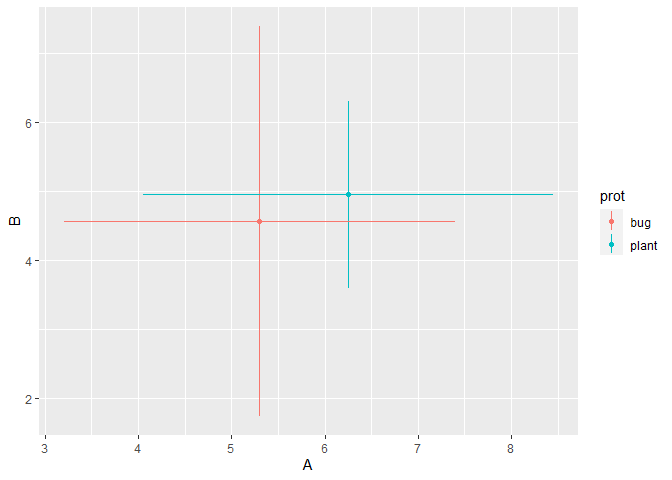

<!-- README.md is generated from README.Rmd. Please edit that file -->

# mxsrquick

<!-- badges: start -->
<!-- badges: end -->

The goal of mxsrquick is to is to make MixSIAR project run quicker

## Installation

You can install the development version of stepurr from
[GitHub](https://github.com/) with:

``` r
# install.packages("devtools")
# devtools::install_github("mncube/mxsrquick")
```

## Example

This is a basic example which shows you how to solve a common problem:

``` r
library(mxsrquick)
#> Loading required package: tidyverse
#> -- Attaching packages --------------------------------------- tidyverse 1.3.1 --
#> v ggplot2 3.3.5     v purrr   0.3.4
#> v tibble  3.1.4     v dplyr   1.0.7
#> v tidyr   1.1.3     v stringr 1.4.0
#> v readr   2.0.1     v forcats 0.5.1
#> -- Conflicts ------------------------------------------ tidyverse_conflicts() --
#> x dplyr::filter() masks stats::filter()
#> x dplyr::lag()    masks stats::lag()

#Create a dataframe which mimics isospace source data
iso_data <- data.frame(iso_a = c(2.2, 4.4, 3.3, 5.1, 3.4),
                       iso_b = c(1.6, 3.9, 5.2, 4.2, 3.7),
                       prot = c("bug", "bug", "bug", "plant", "plant"))

#Create an isospace plot using source groups' means and standard deviations
#Use tdf1 and tdf2 to correct for trophic discrimination factors
source_biplot(data = iso_data, group = prot, 
              var1 = iso_a, var2 = iso_b, 
              tdf1 = c(2, 1), tdf2 = c(1, 1),
              x_lab = "A", y_lab = "B")
```


